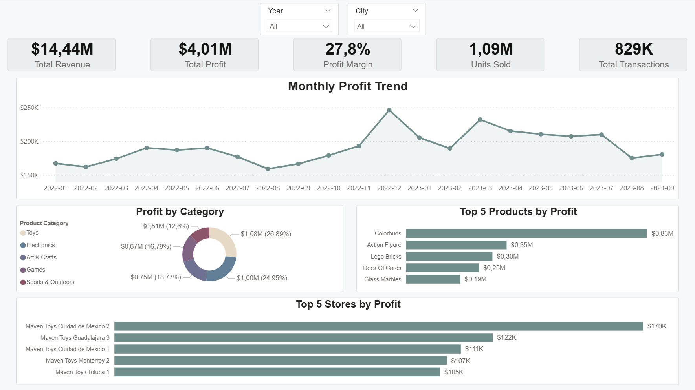
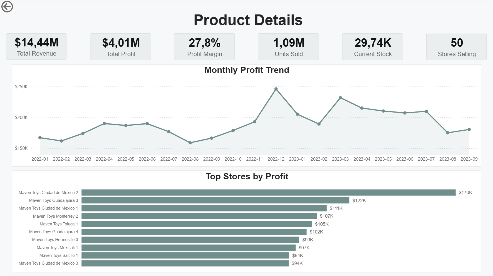

# Maven Toys Sales Analytics

## Project Overview

This project is an end-to-end sales analysis of Maven Toys, a fictional retail toy store chain. 
The goal of this project was to clean and validate raw retail data, build a star-schema data model and create an interactive Power BI dashboard for business analysis. 

The project has been built using SQL Server and Power BI.

The final dashboard allows users to analyze revenue, profit, product performance, store performance, inventory levels and trends over time.

---

## Project Highlights

- End-to-end analytics project
- SQL data cleaning using Views
- Star schema data model
- Interactive Power BI dashboard
- Drill-through navigation
- Dynamic DAX measures
- Complete technical documentation

---

## Dashboard Preview 

### Executive Summary

### Product Details

## Business Objectives

The dashboard was designed to answer the following business questions:

- How has profit changed over time?
- Which product categories generate the highest profit?
- Which products are the most profitable?
- Which stores generate the highest profit?
- How does a selected product perform across stores?
- What is the current stock level for selected products?

---

## Dataset

The dataset consists of four main tables:

| Table | Description |
|---|---|
| Sales | Transaction-level sales data |
| Products | Product details, categories, costs and prices |
| Stores | Store names, locations and when they were opened |
| Inventory | Current stock levels by store and product |

The Sales table contains over 800 000 transaction records.

---

## Tools Used

- Microsoft SQL Server
- SQL Server Management Studio (SSMS)
- T-SQL
- Power BI
- DAX
- Git
- GitHub

---

## Project Workflow

1. Data Understanding
2. Data Quality Checks
3. Business Validation
4. Data Issues Identification
5. Data Cleaning with SQL Views
6. Power BI Data Model
7. Dashboard Development

---

## Data Cleaning

Raw tables were not modified directly.  
Instead, cleaned SQL views were created and used as the source for Power BI.

Main transformations included:

- Converting `Sales.Units` from `NVARCHAR` to `INT`
- Converting `Inventory.Stock_On_Hand` from `NVARCHAR` to `INT`
- Removing `$` from product cost and price fields
- Converting product cost and price to `DECIMAL(10,2)`

Created SQL views:

- `vw_sales_clean`
- `vw_products_clean`
- `vw_inventory_clean`
- `vw_stores_clean`

---

## Data Model

The Power BI model uses a star-schema style structure.

Fact tables:

- Sales
- Inventory

Dimension tables:

- Products
- Stores
- Calendar

All relationships use single-direction filtering.

A dedicated calendar table was created to support time intelligence and date-based analysis.

---

## Dashboard Pages

### Executive Summary

This page provides a high-level overview of business performance.

Main elements:

- Total Revenue
- Total Profit
- Profit Margin
- Units Sold
- Total Transactions
- Monthly Profit Trend
- Profit by Category
- Top 5 Products by Profit
- Top 5 Stores by Profit

---

### Product Details

This page is accessed through drill-through from the Executive Summary page.  
It provides detailed analysis for a selected product.

Main elements:

- Product-specific revenue and profit
- Profit margin
- Units sold
- Current stock
- Stores selling the selected product
- Monthly profit trend
- Top stores for selected product

---

## Key Power BI Features

- Interactive slicers
- Custom tooltips
- Drill-through navigation
- Dynamic page titles
- Dynamic chart titles
- Calendar table
- DAX measures
- Cross-filtering between visuals

---

## Key DAX Measures

Examples of measures created in the report:

- Total Revenue
- Total Profit
- Profit Margin
- Units Sold
- Current Stock
- Stores Selling Product
- Dynamic page titles
- Dynamic chart titles

---

## Documentation

Detailed documentation is available in the `documentation` folder:

| File | Description |
|---|---|
| `01_data_understanding.md` | Initial data exploration |
| `02_data_quality.md` | Nulls, duplicates and key checks |
| `03_business_validation.md` | Business rule validation |
| `04_data_issues.md` | Data issues found before cleaning |
| `05_data_cleaning.md` | SQL cleaning process |
| `06_data_model.md` | Star schema and relationships |
| `07_dashboard.md` | Dashboard structure and features |
