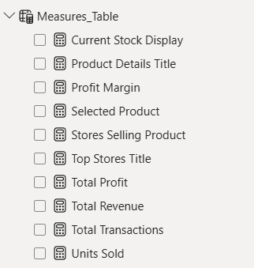

# Dashboard

```
The Power BI dashboard consists of two interactive pages designed to provide both a high-level business overview and detailed product analysis.
```

## Executive Summary


### Purpose 

```Provides a high-level overview of business performance.```

### KPI Cards

  - Total Revenue
  - Total Profit
  - Profit Margin
  - Units Sold
  - Total Transactions

### Visualizations

#### Monthly Profit Trend

```Shows profit evolution over time.```

#### Profit by Category

```Displays contribution of each product category.```

#### Top 5 Products by Profit

```Highlights the most profitable products.```

#### Top 5 Stores by Profit

```Shows best performing stores.```

### Interactive Features

  - Year slicer
  - City slicer
  - Cross filtering
  - Tooltips
  - Drill-through to Product Details


## Product Details


### Purpose 

```Provides detailed analysis for a selected product.```

### KPI Cards
  - Total Revenue
  - Total Profit
  - Profit Margin
  - Units Sold
  - Current Stock
  - Stores Selling

### Visualizations

#### Monthly Profit Trend

```Monthly profit for selected product.```

#### Top Stores Selling Product

```Shows which stores generated the highest profit for the selected product.```

### DAX Measures



### Dashboard Features

| Feature         | Description                                    |
| --------------- | ---------------------------------------------- |
| KPI Cards       | Advanced business metrics                    |
| Drill-through   | Product-level navigation                       |
| Tooltips        | Additional context on hover                    |
| Dynamic Titles  | Automatically updated based on selected product |
| Cross-filtering | Selecting visuals filters the rest of the page |
| Slicers         | Filter by Year and City                        |
